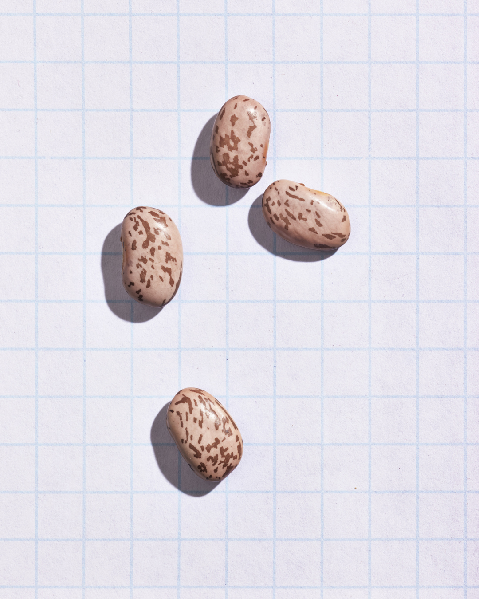
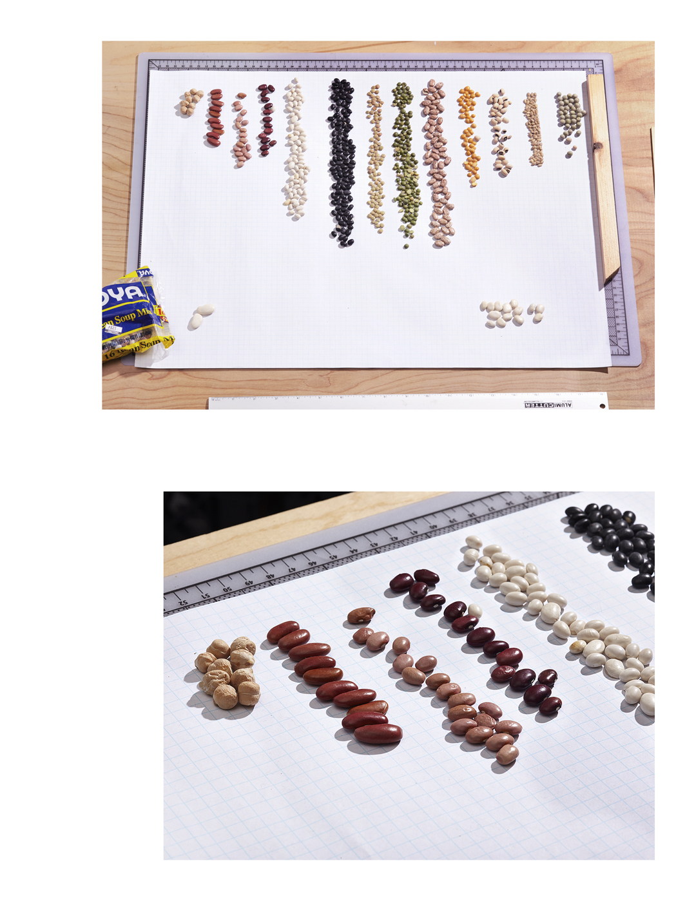

# Sixteen Bean Soup

Inspired by [this project](https://github.com/zonination/skittles) and a general fondness for [minestrone soup](http://allrecipes.com/recipe/13333/jamies-minestrone/).

Pinto Beans (_phaseolus vulgaris_)

- [Edible Dry Bean Data](sixteen-bean-data)

## to do

- ~~arrange and count beans~~
- find ~~way~~ better way to arrange and count more beans
- cross-ref USDA, ACS/Census data

The first count, before building a crude wooden matrix to sort beans. Distribution naturally appeared Gaussian, rather deceptively.

